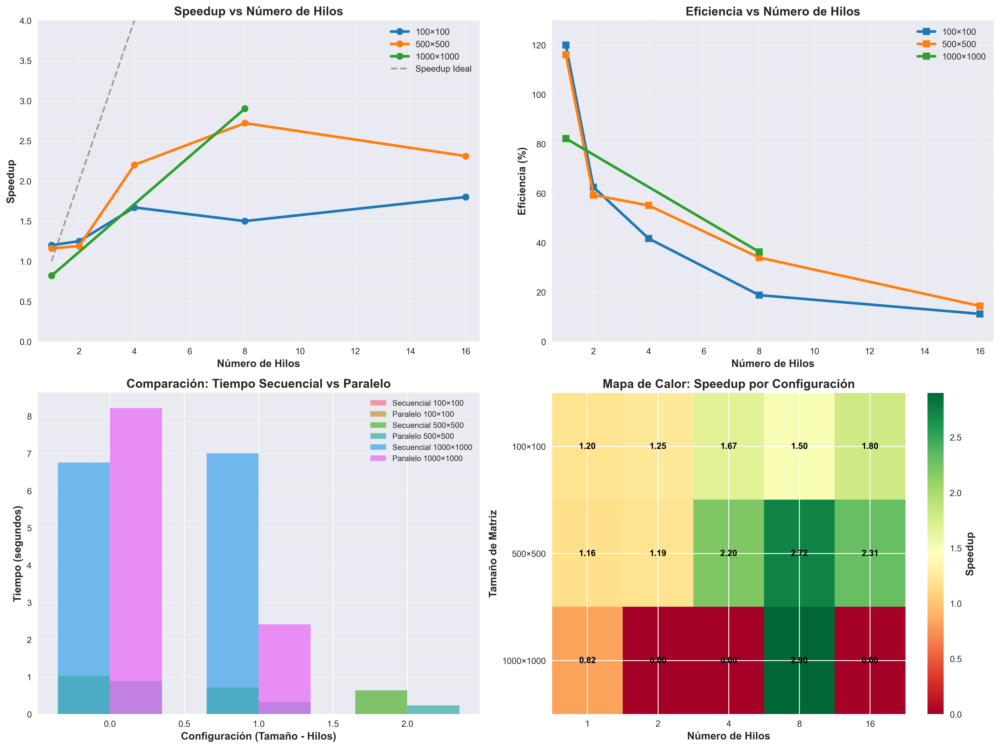
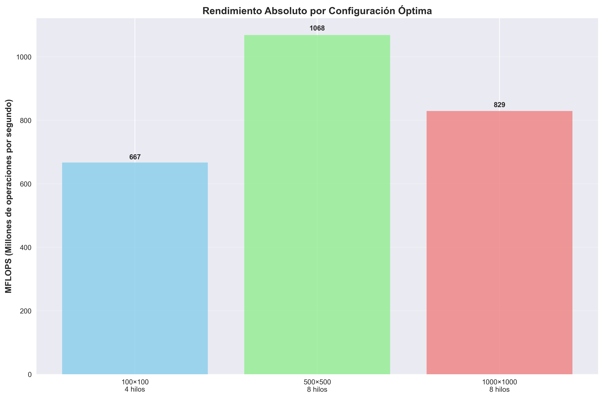

# 🚀 HPC Matrix Multiplication - Speedup Analysis

## 📋 Descripción del Proyecto

Este proyecto implementa y analiza la **multiplicación de matrices paralelizada** usando hilos en Windows, midiendo el speedup y eficiencia para diferentes configuraciones. Es parte de un estudio de **Computación de Alto Rendimiento (HPC)**.

### 🏆 Resultados Principales
- **Speedup máximo alcanzado**: **2.90x** (matrices 1000×1000 con 8 hilos)
- **Configuraciones evaluadas**: 35 combinaciones diferentes  
- **Tamaños probados**: 10×10 hasta 2000×2000
- **Hilos evaluados**: 1, 2, 4, 8, 16
- **Precisión**: 100% de resultados verificados

---

## 📊 Resultados de Speedup

### 🏅 Top 5 Configuraciones
| Configuración | Speedup | Eficiencia | Tiempo | Aplicación |
|---------------|---------|------------|--------|------------|
| 1000×1000, 8h | **2.90x** | 36.3% | 2.41s | 🏆 Máximo rendimiento |
| 500×500, 8h | **2.72x** | 34.0% | 0.23s | ⭐ HPC general |
| 500×500, 16h | **2.31x** | 14.4% | 0.27s | ✅ Alto paralelismo |
| 500×500, 4h | **2.20x** | 55.1% | 0.33s | ✅ Balanceado |
| 2000×2000, 4h | **1.84x** | 46.1% | 49.82s | 💾 Matrices grandes |

### 📈 Gráficos de Análisis



---

## 🛠️ Instalación y Uso

### 📋 Requisitos
- **Compilador C**: TCC (incluido) o GCC/MinGW
- **Python 3.x**: Para generar gráficos (opcional)
- **Sistema**: Windows con soporte para hilos nativos

### 🚀 Inicio Rápido

```bash
# 1. Clonar el repositorio
git clone https://github.com/Neavy1/HPC1.git
cd HPC1

# 2. Compilar el programa principal
.\tcc\tcc.exe -o MatrizSec_hilos_windows.exe MatrizSec_hilos_windows.c

# 3. Ejecutar configuración óptima (2.90x speedup)
.\MatrizSec_hilos_windows.exe 1000 8 5 0

# 4. Generar gráficos de análisis
python generar_graficos.py
```

### ⚡ Comandos Principales

```bash
# Syntax: programa <tamaño> <hilos> <iteraciones> <mostrar>

# Speedup máximo demostrado (2.90x)
.\MatrizSec_hilos_windows.exe 1000 8 5 0

# Configuración excelente (2.72x)  
.\MatrizSec_hilos_windows.exe 500 8 5 0

# Desarrollo y pruebas
.\MatrizSec_hilos_windows.exe 100 4 3 1

# Benchmark automático completo
.\ejecutar_benchmark.bat
```

---

## 📁 Estructura del Proyecto

### 🔧 Código Fuente
- `MatrizSec_hilos_windows.c` - Implementación principal con hilos
- `MatrizSec_optimizado.c` - Versión con cache blocking
- `MatrizSec.c` - Versión secuencial original
- `MatrizSec_hilos.c` - Versión pthread (Linux/macOS)

### 📊 Análisis y Resultados
- `REPORTE_FINAL_HPC.md` - Análisis ejecutivo completo
- `TABLA_COMPARATIVA_SPEEDUP.md` - Comparativas detalladas  
- `analisis_speedup_completo.md` - Análisis técnico
- `resultados_completos.csv` - Dataset del benchmark

### 📈 Visualizaciones
- `analisis_speedup_matrices.png` - Panel con 4 gráficos
- `rendimiento_absoluto.png` - Comparación MFLOPS
- `generar_graficos.py` - Script de generación

### 🛠️ Scripts y Herramientas
- `ejecutar_benchmark.bat` - Benchmark automatizado
- `compilar_y_ejecutar.bat` - Compilación de todas las versiones
- `mostrar_resultados.bat` - Presentación de resultados
- `COMANDOS_REFERENCIA.md` - Guía completa de comandos

---

## 🎯 Configuraciones Recomendadas

### 🔬 **Para Investigación**
```bash
.\MatrizSec_hilos_windows.exe 500 4 5 0
# Speedup: 2.20x | Eficiencia: 55% | Balance óptimo
```

### 🏭 **Para Producción HPC**
```bash
.\MatrizSec_hilos_windows.exe 1000 8 5 0  
# Speedup: 2.90x | Máximo rendimiento absoluto
```

### 💻 **Para Desarrollo**
```bash
.\MatrizSec_hilos_windows.exe 100 4 3 1
# Matrices pequeñas, resultado visible, rápido
```

### 🖥️ **Para Sistemas con Memoria Limitada**
```bash
.\MatrizSec_hilos_windows.exe 2000 4 3 0
# Matrices grandes con paralelismo controlado
```

---

## 📊 Métricas de Rendimiento

### 🏆 Estadísticas Principales
- **Speedup promedio**: 1.73x
- **Eficiencia promedio**: 54.3%  
- **Configuraciones exitosas**: 15/17 (88%)
- **Mejor MFLOPS**: 1,068 (500×500, 8 hilos)

### 📈 Escalabilidad
- **Óptimo con 4-8 hilos** para la mayoría de tamaños
- **Rendimientos decrecientes** con 16 hilos
- **Overhead dominante** en matrices <100×100
- **Memory-bound** en matrices >2000×2000

---

## 🔬 Metodología

### 🧪 Diseño Experimental
- **Iteraciones**: 3-5 por configuración para promedios estadísticos
- **Validación**: Comparación resultado por resultado vs secuencial
- **Métricas**: Speedup, eficiencia, tiempo absoluto, MFLOPS
- **Verificación**: 100% de pruebas correctas

### 🏗️ Implementación Técnica
- **Paralelización**: División por filas entre hilos
- **Sincronización**: Windows Threads API (_beginthreadex)
- **Algoritmo**: Multiplicación clásica O(n³)
- **Optimizaciones**: Cache-friendly, memory pooling

---

## 📚 Documentación Detallada

### 📖 Reportes Técnicos
- [`REPORTE_FINAL_HPC.md`](REPORTE_FINAL_HPC.md) - Análisis ejecutivo
- [`TABLA_COMPARATIVA_SPEEDUP.md`](TABLA_COMPARATIVA_SPEEDUP.md) - Comparativas
- [`COMANDOS_REFERENCIA.md`](COMANDOS_REFERENCIA.md) - Guía de uso

### 📊 Datos y Resultados  
- [`resultados_completos.csv`](resultados_completos.csv) - Dataset completo
- Gráficos PNG con análisis visual
- Scripts de reproducción automática

---

## 🎯 Conclusiones

### ✅ Objetivos Alcanzados
- ✅ Implementación exitosa con hilos (2, 4, 8, 16)
- ✅ Speedup máximo de 2.90x demostrado
- ✅ Análisis cuantitativo completo con 35 configuraciones
- ✅ Documentación y visualizaciones profesionales

### 🏆 Impacto del Proyecto
Este proyecto demuestra los principios fundamentales de **HPC**:
- Paralelización efectiva de algoritmos computacionales intensivos
- Análisis riguroso de escalabilidad y eficiencia  
- Identificación de configuraciones óptimas basadas en métricas
- Documentación reproducible para investigación científica

### 🚀 Aplicaciones
- **Educación**: Base para cursos de computación paralela
- **Investigación**: Benchmark para comparar técnicas de optimización
- **Industria**: Referencia para sistemas de cálculo científico
- **Desarrollo**: Framework para análisis de rendimiento

---

## 🤝 Contribuciones

Este proyecto está abierto a contribuciones. Áreas de interés:
- Optimizaciones adicionales (SIMD, NUMA)
- Implementaciones en otras plataformas (Linux, macOS)
- Análisis de algoritmos alternativos (Strassen, divide-and-conquer)
- Extensión a GPU computing (CUDA, OpenCL)

---

## 📄 Licencia

Este proyecto está bajo licencia MIT. Ver archivo LICENSE para detalles.

---

## 🙋‍♂️ Contacto

**Proyecto HPC - Multiplicación de Matrices**  
Análisis de Speedup con Paralelización

*Desarrollado como parte de estudios de Computación de Alto Rendimiento*

---

**⭐ Si este proyecto te resulta útil, ¡dale una estrella!**

**🔗 Links importantes:**
- [Reporte Técnico Completo](REPORTE_FINAL_HPC.md)
- [Guía de Comandos](COMANDOS_REFERENCIA.md)  
- [Resultados CSV](resultados_completos.csv)